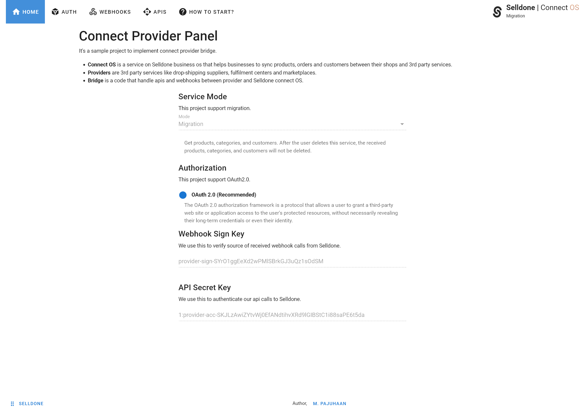
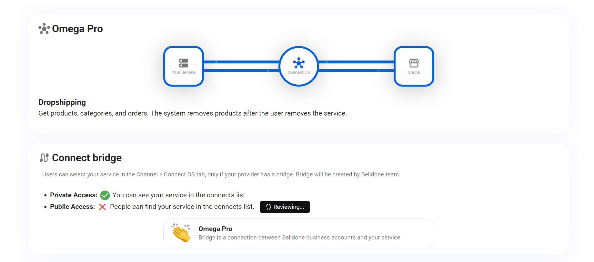
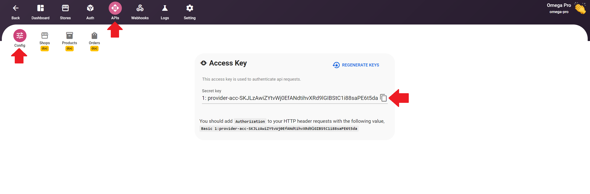
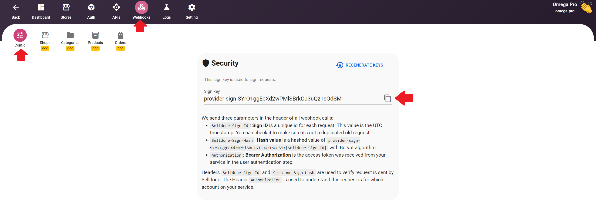
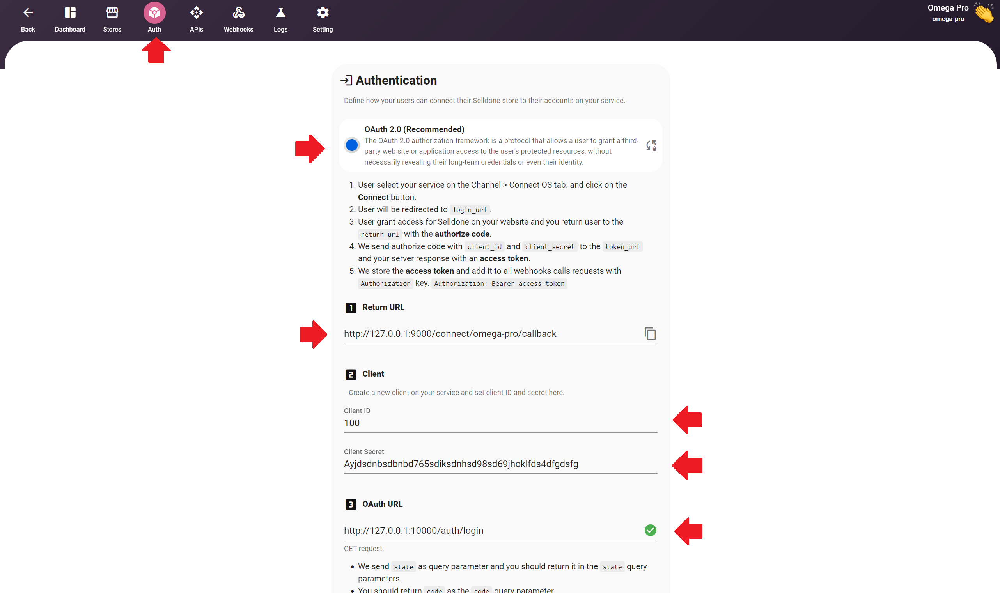

<p align="center"></p>

# Connect Provider - Sample Laravel Project

This is a sample project to provide access to **Selldone Connect Provider**. With this package
you will be able to create a connect bridge or work with all aspects of shops on Selldone.

- [Selldone](https://selldone.com/)
- [API Documentation](https://selldone.com/documents)

**⚠ IMPORTANT!** It's just a test project! Never use it as live/production!

## Official Documentation

* **Connect Provider Panel:** Documentation for Connect Provider can be found on
  the [Selldone website](https://selldone.com/shuttle/providers).
* **APIs:** https://selldone.com/documents.

## Connect Provider

If you are a retail/ecommerce service provider like drop-shipping supplier, you will be able to create a connect
provider bridge on Selldone, With this option, your clients and other merchants on SD will be able to connect their shop
to your service just by one click and sync products. When a new order checkout, we create sub-orders  (fulfilment) and
send them to related connect providers.

## Build Frontend
This project has a sample frontend with **Vue**.
```shell
npm watch
```
or
```shell
yarn watch
```
Output webapp:




## Run Backend
You should deploy this **Laravel** project on a public server to be able to connect it to Selldone via Webhooks.

```shell
php artisan serve --port=80
```


## How to start

1. Go to the providers panel and create a new provider.
2. Open the created provider and complete information about your service on the setting tab.
3. Go to the Dashboard and click on create connect bridge. To create the bridge you should 1- have a wallet with USD currency ( Create wallet) and 2- have 20USD charge. Users can select your service in the Channel > Connect OS tab, only if your provider has a bridge.
4. Get Access Token in the APIs tab, and get Webhook Sign Key in the webhooks tab. You can use access token in Authorization header of API request, and use sign key to validate received webhooks from Selldone.
5. Go to the Auth tab and setup users authentication flow.
6. Implement all required webhooks (required).
7. Using APIs are optional and depends on your service.


## Supported Modes

###  Migration
Get products, categories, and customers. After the user deletes this service, the received products, categories, and customers will not be deleted.

### Dropshipping
Get products, categories, and orders. The system removes products after the user removes the service.


## Configuration on Selldone

#### Create new provider for Connect OS
Go **[here](https://selldone.com/shuttle/providers)** and create a new provider.
<p align="center"></p>

#### Created bridge
<p align="center"></p>


#### Get API key
<p align="center"></p>


#### Get Webhook sign key
<p align="center"></p>


#### Config Auth
<p align="center"></p>

## Author & Designer

 <b>Mehrdad Pajuhaan</b>

- [Pajuhaan Linkedin](https://www.linkedin.com/in/pajuhaan)

## License

Laravel Selldone Connect Provider is open-sourced software licensed under the [MIT license](LICENSE.md).


